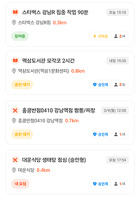
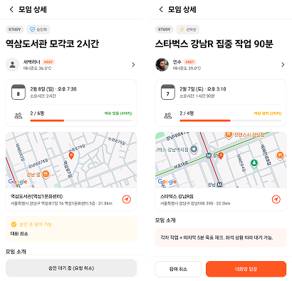

# Action Mate

**모임 상태와 사용자 상태가 충돌하는 UI를 ‘상태 매트릭스 정책’으로 관리한 위치 기반 모임 앱 (Mobile)**

모임의 진행 상태와 사용자의 참여 상태가 동시에 변하는 환경에서

버튼/뱃지/비활성 규칙이 화면마다 달라지지 않도록 **우선순위 기반 정책 함수**로 UI 분기를 통합했습니다.

---

## Core Idea: 상태 매트릭스로 UI 분기 중앙화

모임 상태(`OPEN / FULL / STARTED / ENDED / CANCELED`)와

사용자 상태(`HOST / MEMBER / PENDING / REJECTED / NONE`)가 조합되면

단순한 `if-else` 분기로는 예외 누락과 규칙 충돌이 쉽게 발생했습니다.

이를 해결하기 위해 **“최종 UI 상태를 결정하는 단일 정책 함수”**를 두고,

각 화면은 해당 함수의 반환값만 사용해 CTA·뱃지·비활성 여부를 렌더링하도록 구성했습니다.

> Policy code: `src/features/meetings/model/tokens.ts`
> 
> 
> (`getMeetingStatusTokens`)
> 

---

## Priority Rule

여러 상태가 동시에 만족될 경우, **사용자의 권한/참여 상태를 우선**하도록 순서를 고정했습니다.

이를 통해 “모임은 마감됐지만 나는 이미 참여 중” 같은 충돌 상황에서도

의도한 UI가 일관되게 유지되도록 했습니다.

---

## Example Matrix (일부 규칙)

| 내 상태 | 모임 상태 | 최종 UI 동작 |
| --- | --- | --- |
| HOST | OPEN / FULL | 관리 화면 이동 (활성) |
| MEMBER | ANY | 참여 중 상태 표시 |
| PENDING | ANY | 승인 대기 (CTA 비활성) |
| NONE | FULL | 모집 마감 (비활성) |
| NONE | OPEN | 참여 신청 (활성) |

※ 전체 규칙은 화면별 분기 없이 정책 함수 내부에서 관리합니다.

---

## Architecture: Expo Router + FSD

- `app/`
→ 화면 진입점 및 네비게이션만 담당 (정책/비즈니스 로직 배제)
- `src/features/`
→ 도메인 단위 로직(auth / meeting / chat 등) 분리
- `src/shared/`
→ 공통 API(axios 인스턴스), UI, hooks 중앙화

기능 추가 시 `features` 단위만 수정하면 되도록 구조를 단순화했습니다.

---

## Tech Stack

- React Native (Expo), TypeScript
- Zustand (Client State), TanStack Query (Server State)
- Axios

---

## Preview

| 상태 분기 리스트 | 상세 화면 (상태별 CTA) |
| --- | --- |
|  |  |
